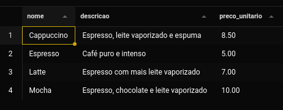
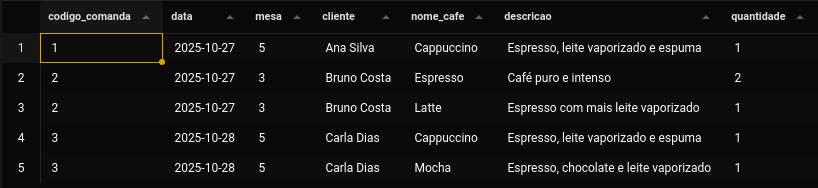
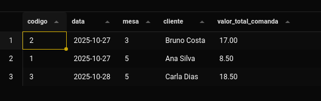
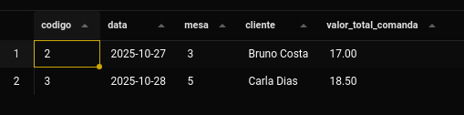
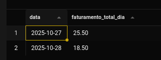

# Cafeteria BomGosto - Controle de Vendas (SQL)

Este projeto é um exercício de banco de dados SQL para gerenciar as vendas da Cafeteria BomGosto. O objetivo é criar a estrutura do banco (schema), inserir dados de exemplo e realizar consultas (queries) para extrair informações de negócio.

## 🚀 Tecnologias

-   **SQL** (O modelo foi escrito em SQL padrão, compatível com PostgreSQL, MySQL, SQLite, etc.)

## 📂 Estrutura de Arquivos

O projeto está organizado da seguinte forma:

```
/projeto_cafeteria/
  ├── 1_CREATE_TABLES.sql
  ├── 2_INSERT_DATA.sql
  ├── 3_QUERIES.sql
/resultados_consultas
  ├── resultado_01.png
  ├── resultado_02.png
  ├── resultado_03.png
  ├── resultado_04.png
  ├── resultado_05.png

```

## 📋 Modelo do Banco (Schema)

Foram criadas 3 tabelas para atender aos requisitos:

1.  **Cardapio**: Armazena os cafés, suas descrições e preços.
    -   `codigo` (PK)
    -   `nome` (UNIQUE)
    -   `descricao`
    -   `preco_unitario`
2.  **Comanda**: Registra cada pedido feito.
    -   `codigo` (PK)
    -   `data`
    -   `mesa`
    -   `cliente`
3.  **ItensComanda**: Tabela de ligação que detalha os itens de cada comanda.
    -   `codigo_comanda` (FK)
    -   `codigo_cardapio` (FK)
    -   `quantidade`
    -   Constraint `PRIMARY KEY (codigo_comanda, codigo_cardapio)` para garantir que não se repita o mesmo café na mesma comanda.

## 📊 Consultas e Resultados

Abaixo estão as 5 consultas solicitadas e seus respectivos resultados com base nos dados de exemplo.

### 1. Listagem do cardápio ordenada por nome



### 2. Detalhe de todas as comandas e seus itens



### 3. Valor total por comanda



### 4. Comandas com mais de um tipo de café



### 5. Faturamento total por data


